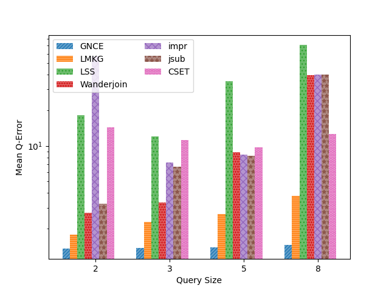

# Appendix 

## Q-Error results, grouped by Query Size (number of triple patterns)

### SWDF

|  |  |
|:---------------------------------------------:|:---------------------------------------------:|
|                 star queries                  |                 path queries                  |

### YAGO

|  |  |
|:---------------------------------------------:|:---------------------------------------------:|
|                 star queries                  |                 path queries                  |

### Wikidata

|  |  |
|:-------------------------------------------------:|:-------------------------------------------------:|
|                   star queries                    |                   path queries                    |
